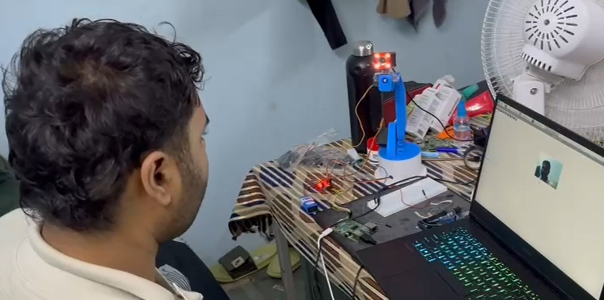
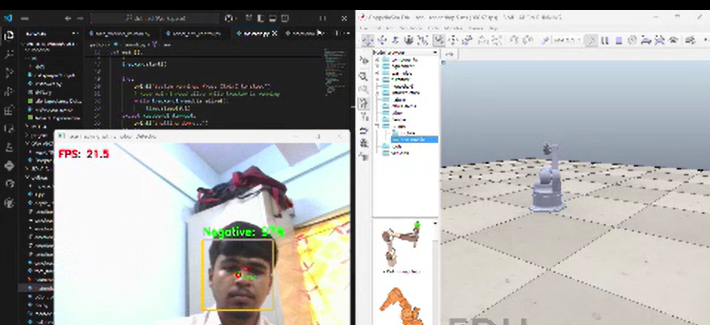

# Face Tracking Robotic Arm with Emotion Analysis

## Project Website
[https://jainithisshs.github.io/Face-tracking-robot-with-emotion-analysis/](https://jainithisshs.github.io/Face-tracking-robot-with-emotion-analysis/)

## Abstract
This project presents the design and implementation of a robotic arm system capable of real-time face tracking and emotion analysis. By integrating computer vision, machine learning, and robotics, the system can detect human faces, classify emotions, and control a robotic arm to interact responsively. Both hardware and simulation environments are provided, with demonstration videos included.

## 1. Introduction
Human-robot interaction is a rapidly growing field, with applications in assistive technology, service robotics, and entertainment. Recognizing human emotions and responding physically can make robots more intuitive and engaging. This project aims to bridge computer vision and robotics by enabling a robotic arm to track faces and respond to detected emotions.

## 2. System Architecture
The system consists of three main modules:
- **Face Tracking:** Uses OpenCV to detect and track faces in real-time video streams.
- **Emotion Analysis:** Employs a binary emotion classifier (positive/negative) using a trained neural network model.
- **Robotic Arm Control:** Controls a robotic arm (hardware or simulated in CoppeliaSim) to follow the detected face and respond to emotion states.

### Project Structure
```
CODE/
    PID_EMOTION.py                # Main integration script
    EMOTION/
        Emotion_Binary_Classifier.py   # Emotion classifier training and inference
        emotion_model_binary_final.h5  # Final trained model (binary)
        emotion_model_binary.h5        # Trained model
        emotion_model_binary.tflite    # TFLite model for edge devices
        emotion_pca_model_binary.pkl   # PCA model for feature reduction
        face_tracking.py               # Face tracking and emotion integration
SIMULATION/
    SIM/
        face_tracking_kalman.py    # Kalman filter for robust tracking
        mainrob.py                 # Main simulation entry point
        rob.ttt                    # CoppeliaSim scene file
        robot_arm_control.py       # Robotic arm kinematics and control
DEMO_HARDWARE.mp4                 # Demo video: hardware implementation
DEMO_SIMULATION.mp4               # Demo video: simulation
```

## 3. Implementation Details

### 3.1 Face Tracking
Face detection is performed using OpenCV’s Haar cascade classifier. The detected face region is used as the region of interest (ROI) for both tracking and emotion analysis. For simulation, a Kalman filter is used to smooth the face position and improve robustness.

### 3.2 Emotion Analysis
The emotion classifier is a binary neural network model trained on facial expression datasets. It distinguishes between positive (e.g., happy, surprise) and negative (e.g., anger, sadness) emotions. The model is implemented in TensorFlow/Keras and exported to both H5 and TFLite formats for flexibility. PCA is used for feature reduction before classification.

### 3.3 Robotic Arm Control
The robotic arm is controlled via PWM signals (hardware) or through the CoppeliaSim API (simulation). The arm’s end effector position is updated in real-time to follow the detected face. In simulation, inverse kinematics and smooth trajectory planning are implemented for realistic movement.

## 4. Results and Demonstrations

### 4.1 Hardware Demo
The hardware demo shows the robotic arm tracking a user’s face and responding to their emotional state. The arm’s movement is smooth and responsive.

[](https://github.com/Jainithisshs/Robotics/blob/main/DEMO_HARDWARE.mp4)

[▶ Click here to watch Hardware Demo](https://github.com/Jainithisshs/Robotics/blob/main/DEMO_HARDWARE.mp4)

---

### 4.2 Simulation Demo
The simulation demo replicates the face tracking and robotic arm control logic in a virtual environment using CoppeliaSim. It enables safe and effective testing before hardware deployment.

[](https://github.com/Jainithisshs/Robotics/blob/main/DEMO_SIMULATION.mp4)

[▶ Click here to watch Simulation Demo](https://github.com/Jainithisshs/Robotics/blob/main/DEMO_SIMULATION.mp4)

## 5. How to Run the Project

### 5.1 Requirements
- Python 3.x
- OpenCV
- TensorFlow / Keras
- Numpy, Scikit-learn
- CoppeliaSim (for simulation)

### 5.2 Setup
1. Clone the repository.
2. Install required Python packages (see code for details).
3. For hardware, connect the robotic arm and run scripts in `CODE/`.
4. For simulation, open `rob.ttt` in CoppeliaSim and run `mainrob.py`.

## 6. Conclusion
This project demonstrates a complete pipeline from emotion recognition to robotic actuation, both in hardware and simulation. It serves as a foundation for more advanced human-robot interaction systems.

## 7. References
- OpenCV documentation: https://opencv.org/
- TensorFlow documentation: https://www.tensorflow.org/
- CoppeliaSim: https://www.coppeliarobotics.com/

## License
This project is for educational and research purposes only.
